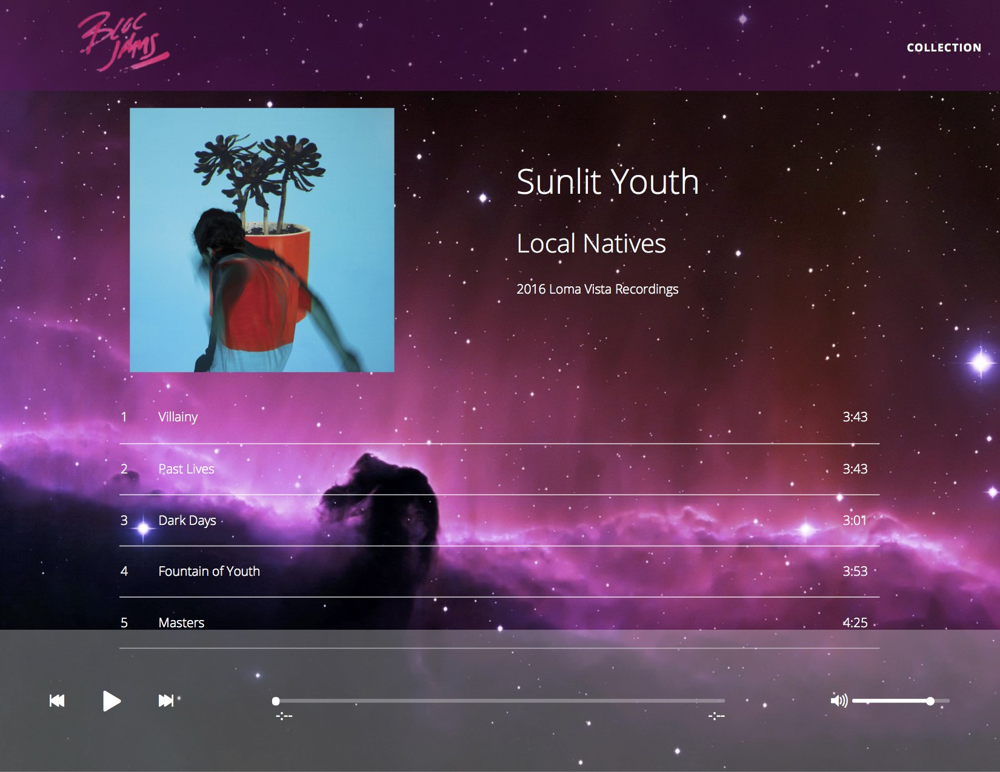

## Bloc Jams

An AngularJS-based Spotify clone





Visit [netlify](buckjams.netlify.com) on a computer or mobile device, or read below to run on your local server.

## Configuration

Start by cloning the repository:

```
$ git clone https://github.com/buckrivard/bloc-jams-angular.git
```

Install the project dependencies by running:

```
$ npm install
```

## Run the Application

Run the application using the Gruntfile's `default` task:

```
$ grunt
```

The default task runs a simple server on port 3000. To view it in a any browser, go to [http://localhost:3000](http://localhost:3000).


## Grunt plugins

A list of the Grunt plugins in this application.

#### Watch

[Grunt watch](https://github.com/gruntjs/grunt-contrib-watch) watches for changes to file content and then executes Grunt tasks when a change is detected.

#### Copy

[Grunt copy](https://github.com/gruntjs/grunt-contrib-copy) copies files from our development folders and puts them in the folder that will be served with the frontend of your application.

#### Clean

[Grunt clean](https://github.com/gruntjs/grunt-contrib-clean) "cleans" or removes all files in your distribution folder (`dist`) so that logic in your stylesheets, templates, or scripts isn't accidentally overridden by previous code in the directory.

#### Hapi

[Grunt Hapi](https://github.com/athieriot/grunt-hapi) runs a server using [`HapiJS`](http://hapijs.com/). Happy is a Node web application framework with robust configuration options.
=======
# bloc-jams-angular

